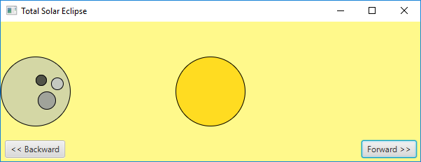
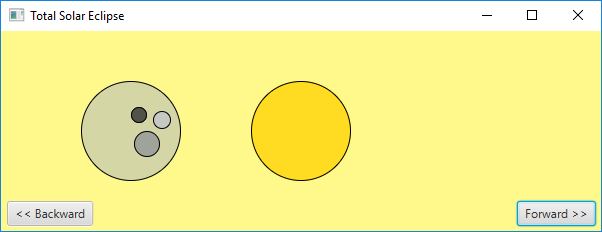
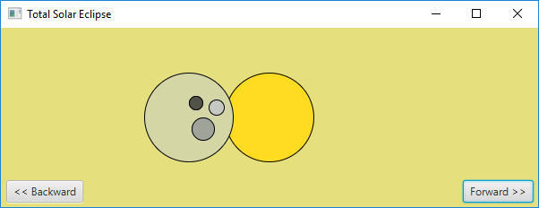
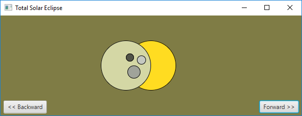
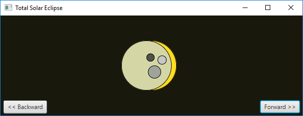
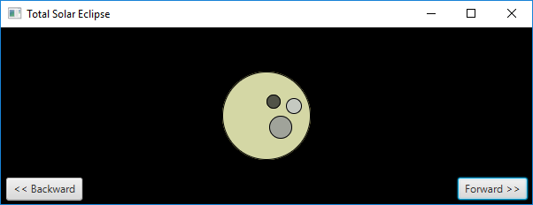
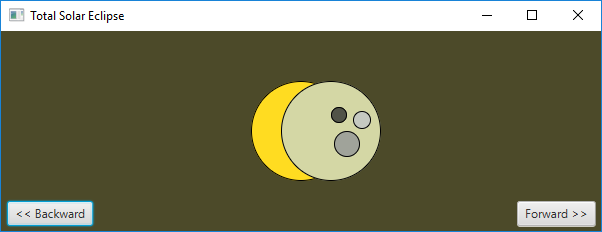
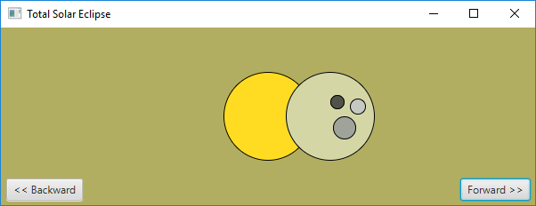
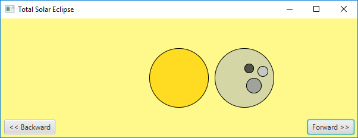

# javafx-shapes-total-solar-eclipse
Example of a Java program that uses the JavaFX framework, using 2D shapes, to draw a simple simulation of a sun and moon that produces an eclipse.

If you want to explore the most basic version, see the 

If you want to explore a little more advaced version, see the 

